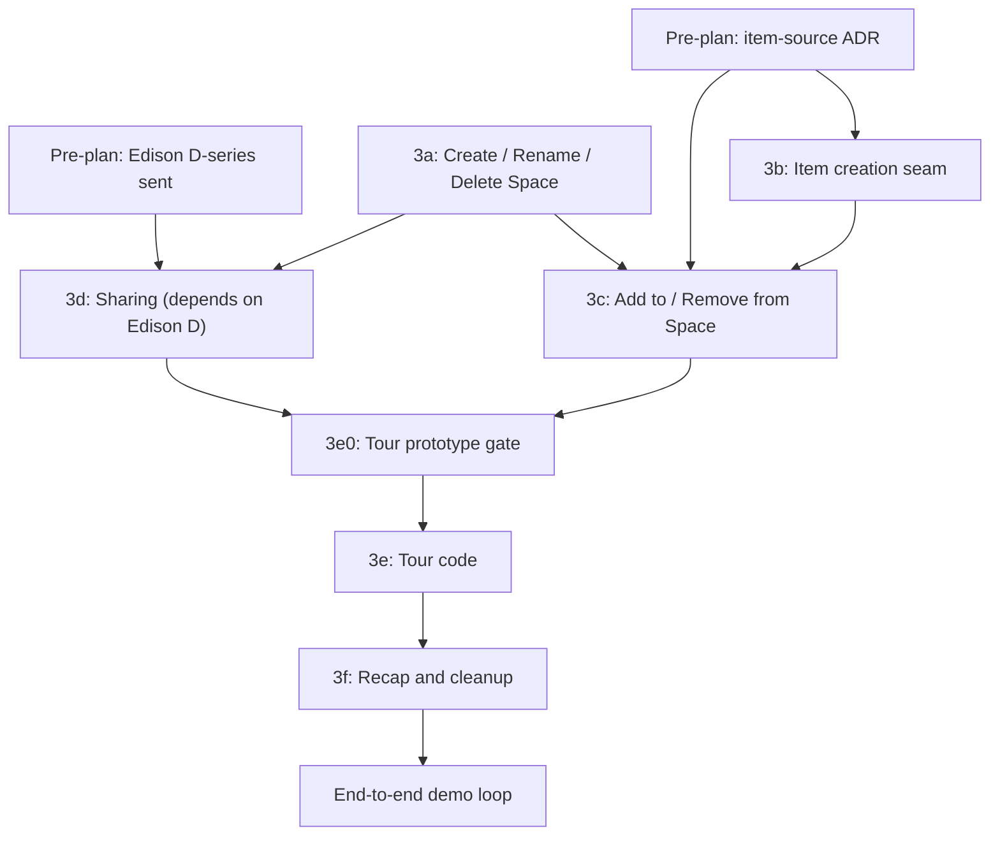

# Lite Spaces Phase 3 — Writes, Sharing, and the Onboarding Tour

This is the canonical source plan for the next slice of the Lite Spaces module. It builds on the foundation laid by [`./spaces-manager-phases_5ab75078.plan.md`](./spaces-manager-phases_5ab75078.plan.md) (Phases 0 → 2: read-only browse). Phase 3 turns Spaces from a viewer into a workspace.

## Conceptual Model

Phase 3 delivers the demo loop end-to-end: write paths, sharing on graph-level ACLs, and an in-Spaces tour that walks a new user from "no Spaces" to "shared a Space with my teammate" using **real** graph state, not simulated.

The narrative is bundled because the loop only teaches when complete; the hardening contract is per sub-phase so each ships as one PR. This is the hybrid framing — one strategic plan, seven shippable chunks.

The three Trust Principles from the existing plan continue to govern, plus one made operational here:

1. **Suggest, don't decide.** Mutations are explicit; no auto-fired writes.
2. **Explainable.** Every grant, every membership, every mutation carries provenance visible in the UI.
3. **Reversible.** Soft-delete by default; every mutation has an inverse method registered against a build-blocking test.
4. **Attributable.** Every mutation event carries `principal` + `accountId`; renderer cannot override.

## Hybrid shipping framing



Each labelled node ships as its own chunk with its own PR, tests, and hardening contract row in [`lite/PORTING.md`](../../lite/PORTING.md). The plan keeps them in one document for narrative coherence and to make the cross-cutting concerns (Trust Principles, Measurement) visible at the plan level instead of per-chunk.

## Pre-plan dependencies

These must land before any 3-series code begins. They run in parallel with each other.

### Pre-A: Item-source ADR

The "what does the user file?" decision affects the data model, not just one sub-phase. It is NOT a sub-phase choice — it is an ADR.

| Option | Shape | Cost | Data-model impact |
|---|---|---|---|
| **B1** | New `lite/items/` module with `save text / save URL / save file` | Medium (new module) | User-authored items share `:Item` label with agent-produced; `:AUTHORED_BY` distinguishes |
| B2 | Re-use existing seams (clipboard, IDW conversation, AI Run Times article) | Low (no new module) | Same data model; integration surface forks across three modules |
| B3 | Tour assumes pre-existing items in graph; no creation in tour | Lowest (no new code) | Tour weakens to "browse what's already there"; doesn't demo creation |

ADR ships in [`lite/DECISIONS.md`](../../lite/DECISIONS.md) before 3b code begins. **Plan recommends B1**; not pre-resolved — a separate ADR conversation must happen.

### Pre-B: Edison D-series questions

Operational, non-Cypher, sent to whoever owns Edison authorization. Mirrors the Phase 0.5 Q5/Q6 pattern documented in [`lite/spaces/DISCOVERY.md`](../../lite/spaces/DISCOVERY.md). Code in 3d cannot begin until D1-D4 return; D5-D7 are needed before 3d ships.

The full question list lives at [`lite/spaces/DISCOVERY-PHASE-3.md`](../../lite/spaces/DISCOVERY-PHASE-3.md) (ships in this plan-doc-creation step). Summary:

| ID | Question | Gates |
|---|---|---|
| D1 | How is per-Space access expressed in the graph? | 3d wire format |
| D2 | What permission levels exist (read / edit / admin / owner)? | 3d picker UI |
| D3 | How is "grant" expressed in Cypher? | 3d SDK |
| D4 | How is "revoke" expressed in Cypher? | 3d SDK |
| D5 | Who can grant (owner / edit / admin)? | 3d Share button visibility |
| D6 | Composition with item ACLs (revisits Phase 0.5 Q6)? | 3c chip filter |
| D7 | Member picker query + PII shape? | 3d picker home + privacy review |

### Privacy review for D7

If the member-picker query returns emails or other PII, Lite must redact / mask before rendering. The plan flags this for a 1-page privacy review **before 3d code begins**, not after — see [`lite/spaces/PRIVACY-REVIEW-PICKER.md`](../../lite/spaces/PRIVACY-REVIEW-PICKER.md). Cheap to do early; expensive to retrofit.

## Reversibility test infrastructure

A new harness lands as part of Phase 3a:

- File: `lite/test/integration/spaces/trust-principles.test.ts`
- Behavior: registers every mutation method introduced in 3a/3b/3c/3d alongside its inverse method. Build fails if a mutation lands without one.
- Pattern: a mutation/inverse `Map<string, { mutate, inverse, restoreCheck }>` registered at module-init time; the test iterates the map and runs `mutate -> inverse -> assert(state == prior)` for each pair against a fixture graph.

Without this harness, "Reversible" is a slogan. With it, every Phase 3 PR has to add its inverse in the same change-set or the build is red.

## Sub-phases

### Phase 3a — Create / Rename / Delete Space

**Goal**: a user can create, rename, and (soft-)delete Spaces from the Lite UI.

- New SDK methods on [`lite/spaces/api.ts`](../../lite/spaces/api.ts):
  - `spaces.create({ name, description?, color?, iconKey? }): Promise<Space>`
  - `spaces.rename(id, name): Promise<Space>`
  - `spaces.delete(id, opts?: { soft?: boolean }): Promise<void>` (default soft)
  - `spaces.undelete(id): Promise<Space>`
- Cypher: `CREATE (s:Space {...})` with id strategy per Edison D8 (server-issued vs client UUID); `OWNED_BY` edge to current account/principal per ADR-040 attribution pattern.
- New error codes in [`lite/spaces/errors.ts`](../../lite/spaces/errors.ts): `SPACES_DUPLICATE_NAME`, `SPACES_DELETE_NON_EMPTY` (delete with items still inside).
- Renderer:
  - "+ New Space" button in [`lite/spaces/spaces.html`](../../lite/spaces/spaces.html) sidebar header.
  - Inline rename on double-click of a sidebar row.
  - Delete affordance in Space-detail panel (separate from item-detail panel).
- Events per ADR-032: `spaces.create.start/.finish/.fail`, `spaces.rename.*`, `spaces.delete.*`, `spaces.undelete.*`.
- Trust-principles harness: register `create / delete-soft` and `rename / rename-back` and `delete-soft / undelete` pairs.

| Trust Principle | How 3a upholds it | Test |
|---|---|---|
| Suggest don't decide | Create / rename / delete are explicit user actions, never auto-fired | n/a (no auto-action surface in 3a) |
| Explainable | Detail panel shows "Created by [principal] at [timestamp]"; "Last renamed [date]" | `spaces-detail-attribution.test.ts` |
| Reversible | Soft-delete by default (`s.deletedAt`); undelete via `spaces.undelete(id)` | `trust-principles.test.ts`: create -> delete -> undelete -> read = original |
| Attributable | Every mutation event carries `principal` + `accountId` | `spaces-event-attribution.test.ts` asserts every event carries both |

### Phase 3b — Item creation seam (per Pre-A ADR)

**Goal**: a user can author and persist a new `:Item` from the Lite UI.

Implementation differs by ADR outcome. The plan assumes B1 (recommended); other branches noted.

If B1 picked:

- New module `lite/items/` with `items.create({ kind, title, content?, sourceUrl? }): Promise<Item>`.
- Cypher: `CREATE (i:Item {id, kind, title, ...})`; `[:AUTHORED_BY]->(:Person)` edge to current principal so it's distinguishable from agent-produced.
- Renderer: minimal "Save text / Save URL" composer reachable from Spaces detail-panel "+" button AND from a global no-shortcut entry point (per ADR-015).
- New error codes: `ITEMS_INVALID_KIND`, `ITEMS_TITLE_REQUIRED`, `ITEMS_TOO_LARGE`.
- Trust-principles harness: register `items.create / items.delete` (soft) and `items.delete / items.undelete` pairs.

| Trust Principle | How 3b upholds it | Test |
|---|---|---|
| Suggest don't decide | Item creation always explicit; no auto-save of clipboard, no background capture | `items-no-auto-create.test.ts` (asserts no IPC fires `items.create` without renderer trigger) |
| Explainable | Detail panel shows authoring principal + timestamp | `items-detail-attribution.test.ts` |
| Reversible | Soft-delete; user-authored items distinguishable from agent-produced via `:AUTHORED_BY` | `trust-principles.test.ts`: create -> delete -> undelete cycle |
| Attributable | `:AUTHORED_BY` edge populated from auth principal at create-time, not trust-the-renderer | `items-authored-by.test.ts` (assert renderer can't override the principal) |

### Phase 3c — Add to / Remove from Space

**Goal**: a user can file an existing item into a Space, and remove it from a Space without deleting the item.

- New SDK methods:
  - `spaces.items.fileInto(itemId, spaceId): Promise<void>`
  - `spaces.items.removeFrom(itemId, spaceId): Promise<void>`
- Cypher: `MERGE (i)-[m:MEMBER_OF {addedBy, addedAt}]->(s)` and corresponding `DELETE` of the same edge. Item never deleted by `removeFrom` — only the membership edge.
- Renderer:
  - "File into..." button in item-detail panel, opens Space picker (multi-select).
  - "Remove from this Space" visible only when viewing item under a Space scope (not Uncategorized).
- Multi-Space: filing into a second Space updates chip strip without reload (re-runs `items.list` for active scope).
- Trust-principles harness: register `fileInto / removeFrom` as inverses.

| Trust Principle | How 3c upholds it | Test |
|---|---|---|
| Suggest don't decide | File / remove always explicit | n/a |
| Explainable | Activity event log on item shows when it joined / left each Space, by whom | `items-membership-history.test.ts` |
| Reversible | Remove only deletes membership edge; the item stays in graph; re-fileInto restores | `trust-principles.test.ts`: file -> remove -> file = original membership |
| Attributable | Each `MEMBER_OF` edge carries `addedBy` + `addedAt` properties | `member-of-edge-attribution.test.ts` |

### Phase 3d — Sharing UX (gated by Pre-B Edison answers)

**Goal**: a user can share a Space with another account member and pick a permission level.

Wire format depends on D1-D4. Plan structure regardless:

- New SDK methods:
  - `spaces.share(spaceId, principal, level): Promise<Grant>`
  - `spaces.unshare(spaceId, principal): Promise<void>`
  - `spaces.listGrants(spaceId): Promise<Grant[]>`
  - `spaces.listAccountMembers(): Promise<Person[]>`
- Account-member home: per D7 outcome, lives in `lite/people/` (new module) OR extends [`lite/auth/api.ts`](../../lite/auth/api.ts).
- Renderer: "Share..." button in Space-detail. Modal with member picker, permission-level radio (per D2), live preview of resulting grant list, revoke inline.
- Notification path: 3d emits `spaces.share.granted` events; the recipient-side notification UI is a Phase 4 chunk (Approval + Audit queue), not 3d. The hook is reserved here.
- Privacy filtering on the picker per [`lite/spaces/PRIVACY-REVIEW-PICKER.md`](../../lite/spaces/PRIVACY-REVIEW-PICKER.md).
- Trust-principles harness: register `share / unshare` pair.

| Trust Principle | How 3d upholds it | Test |
|---|---|---|
| Suggest don't decide | Share is explicit; no auto-share, no "share-with-everyone" defaults | `share-no-defaults.test.ts` |
| Explainable | Grant list shows granter principal, grant timestamp, level, optional rationale text field | `grant-explainability.test.ts` |
| Reversible | Unshare removes the grant; rebuilds prior state | `trust-principles.test.ts`: share -> unshare -> share roundtrip |
| Attributable | Every grant carries granting principal in audit log | `share-event-attribution.test.ts` |

### Phase 3e0 — Tour prototype gate (non-code)

The 90-second / 3-minute claims are aspirational without evidence. This sub-phase is a **non-code prototype** that gates 3e:

- HTML/CSS mock of the tour with the step strip, copy variants, and click-through using fake state.
- 2-3 user tests with people who have NOT seen the Spaces module.
- Iterate copy and step boundaries; record observed median + p95 time-to-completion.
- 3e is unblocked when prototype shows median ≤ 90s AND p95 ≤ 180s, OR the targets are revised in writing with rationale.

Skipping this gate ships a tour that COULD be 4 minutes p50 because step 4 was confusing and we didn't catch it. The cost of the prototype is one afternoon; the cost of skipping is permanent.

### Phase 3e — Onboarding tour code (post-prototype)

**Goal**: a brand-new user opens Spaces, takes a 90-second guided flow, and ends with a real Space they shared with a teammate.

- New `lite/spaces/onboarding/` sub-module (intentionally separate from [`lite/onboarding/`](../../lite/onboarding/) — that is the chrome checklist; this is a guided flow; different shape, different concern).
- Persisted in KV `lite-spaces-onboarding/default`: `{ schemaVersion: 1, dismissedAt?, completedAt?, lastStepReached?, principalAtStart? }`.
- Step strip across the top of the Spaces window with progress + skip + back-out controls.

#### Tour entry — addressing the "already have Spaces" gap

Three entry points, not just empty state:

1. **Empty state CTA**: "Take the 90-second tour" card on first-paint when the user has zero Spaces. Default trigger.
2. **Permanent header button**: "How does this work?" button always visible in the Spaces window header. Resolves the "user joins an account with 50 existing Spaces and never sees the empty state" problem.
3. **Settings → Diagnostics**: "Replay Spaces tour" button. Rare path; mostly QA.

#### Steps

| # | Action | Calls | Failure handling |
|---|---|---|---|
| 1 | Name your first Space | 3a `spaces.create` | On failure: stay on step 1 with banner "Couldn't create — [reason]. Try a different name?" |
| 2 | Drop something into it | 3b `items.create` + 3c `items.fileInto` | On failure: keep step 2 active; offer "Skip this step" |
| 3 | Open it back up | no mutation; existing 2e detail panel | Read-only; failure unlikely |
| 4 | Share with a teammate | 3d `spaces.share` | On failure: see "Cleanup-path failure handling" below |
| 5 | Recap and keep / clean up | links to 3a `spaces.delete` + 3b items delete + 3d unshare | See "Cleanup-path failure handling" |

### Phase 3f — Recap card + cleanup with failure paths

The "Delete and start fresh" path is multi-mutation:

1. Revoke all shares from the tour Space (1+ mutations)
2. Remove tour items from the tour Space (1+ mutations)
3. Soft-delete the tour items (1+ mutations)
4. Soft-delete the tour Space (1 mutation)

Failure modes to handle:

| Step fails | UI response |
|---|---|
| 1 fails | Stop. Show "We couldn't fully clean up — your shares are still active. [Retry] or [Open Settings]". Do NOT proceed to delete the Space (would orphan the share). |
| 2 fails | Stop. Show "Your items are still in the Space. [Retry] or [Keep them]". |
| 3 fails | Continue (item soft-delete is recoverable later). Log warning. |
| 4 fails | Stop. Items already deleted; Space empty but still exists. Show "Your tour items are gone but the Space stayed. [Retry] or [Keep this Space]". |

Without this matrix, "delete and start fresh" can leave the user with worse state than starting over. That's the cardinal sin for an onboarding flow. The matrix is here because real cleanup paths fail in production.

## Measurement

The tour ships with named events for funnel analysis, not just span logging:

- `spaces.tour.start` — `{ entryPoint: 'empty-state' | 'header' | 'settings' }`
- `spaces.tour.step.enter` — `{ step: 1..5 }`
- `spaces.tour.step.exit` — `{ step, outcome: 'next' | 'skip' | 'back' | 'abandon', durationMs }`
- `spaces.tour.complete` — `{ durationMs, cleanedUp: boolean }`
- `spaces.tour.abandon` — `{ lastStep, lastDurationMs, reason: 'closed' | 'navigated-away' | 'error' }`

These events flow through [`lite/logging/api.ts`](../../lite/logging/api.ts) and are visible in the log server (port 47392) at `category=spaces` with `event` filter. Sketched dashboard query:

```
funnel:
  step1_enter -> step1_exit{outcome:next}: %
  step2_enter -> step2_exit{outcome:next}: %
  step3_enter -> step3_exit{outcome:next}: %
  step4_enter -> step4_exit{outcome:next}: %
  step5_enter -> tour.complete: %
median_total_ms, p95_total_ms, abandon_rate
```

Without this, we won't know if the tour is working post-launch.

## Cross-cutting concerns

### Auth and permissions

- All mutations require signed-in OneReach session.
- D5 governs who can grant; renderer hides Share button when caller lacks grant rights.
- Privacy filtering on the member picker per the privacy review.

### Reversibility coverage

- Every method registered in `trust-principles.test.ts` mutation/inverse table.
- Test fails build if a mutation method lands without an inverse.

### Telemetry

- Every public-API call emits a span (Trust Principle: Attributable extends here).
- Tour-specific events listed above are mandatory in 3e/3f; spans alone are not enough for funnel analysis.

## Testing strategy

| Layer | New tests |
|---|---|
| SDK types | Phase 3 method signatures + new error codes pass conformance contract |
| SDK client | Cypher source regression guards for create/delete/share/unshare/file/unfile (mirrors existing [`lite/test/unit/spaces-sdk-client.test.ts`](../../lite/test/unit/spaces-sdk-client.test.ts)) |
| Renderer (pure) | New DOM builders (sidebar "+ New", share modal, tour step strip, recap card) |
| Tour state machine | Step transitions, skip / back / abandon semantics, persisted dismiss / completion |
| Cleanup failure matrix | Each cleanup step's failure mode; retry path; "leave it" path |
| Trust Principles | `trust-principles.test.ts` — mutation/inverse pairing for every new mutation method |
| Tour analytics | `tour-events.test.ts` — every transition emits the expected event with correct payload |
| Integration | Full create → file → share → cleanup loop in `lite/test/integration/spaces/` against fixture graph |
| Platform contract | Stub consumer outside `lite/spaces/` proves the new write surface is consumable |

## Success criteria

- **3a**: Create Space with name + color in <5s; soft-delete reversible; reversibility test green.
- **3b**: User authors and saves a text/URL item from Lite in <10s; user-authored items distinguishable from agent-produced via `:AUTHORED_BY`.
- **3c**: File / remove updates chips without reload; reversibility test green.
- **3d**: User shares Space with another account member, picks level, sees grant in detail panel; recipient (verified via second test account) sees the Space in their sidebar; no PII leaks in member picker (privacy review signed off).
- **3e0**: Prototype clears median ≤ 90s, p95 ≤ 180s with 2-3 test users — OR targets revised in writing with rationale before 3e code begins.
- **3e**: Tour entry reachable from empty state, header button, and Settings; events emit per measurement spec.
- **3f**: Cleanup-path failure matrix all paths reachable in tests; "delete and start fresh" leaves zero residue when all 4 steps succeed; failure paths leave user with explainable state.
- **Cross-cutting**: All Phase 3 mutations have registered inverses (build fails otherwise); all events follow ADR-032 + measurement-spec naming; lite startup time unchanged; conformance contract green; zero permission-leak bugs.

## Roadmap impact (delivered with this plan-doc)

- [`lite/spaces/ROADMAP.md`](../../lite/spaces/ROADMAP.md): "Phase 3 — Write paths" entry expands to writes + sharing + tour as one phase, seven-chunk shipping cadence.
- [`lite/PORTING.md`](../../lite/PORTING.md): seven new chunks under Active Ports — `spaces-3a`, `spaces-3b`, `spaces-3c`, `spaces-3d`, `spaces-3e0`, `spaces-3e`, `spaces-3f` — each with its own hardening status block.
- [`lite/LITE-PUNCH-LIST.md`](../../lite/LITE-PUNCH-LIST.md): the three intro-card / empty-state items from earlier conversation collapse into "Phase 3 onboarding tour."
- [`lite/DECISIONS.md`](../../lite/DECISIONS.md): ADR-048 documents the Phase 3 trajectory + Trust Principles operationalization. Pre-A item-source ADR (separate ADR) ships before 3b code.

## Open decision points

- Pre-A: B1 / B2 / B3 for item-source seam (recommended B1; ADR before 3b code).
- D1-D7: Edison answers gating 3d (sent in parallel with plan creation).
- Soft-delete vs hard-delete UX in 3a (default soft; admin override).
- 3e prototype outcome: are 90s / 180s targets achievable? Revisable in writing.
- Notification path on share grant (reserved hook in 3d, built in Phase 4).
- Cross-account / cross-tenant sharing: Phase 5+, not this plan.

## What's NOT in this plan

- Approval + Audit queue (Phase 4 in [`lite/spaces/ROADMAP.md`](../../lite/spaces/ROADMAP.md)).
- Librarian agents (Phase 4+).
- Activity feed of who-did-what-today (Phase 4+).
- Pin / favorite Spaces (small follow-up; not roadmap-level).
- Cross-account / cross-tenant sharing (Phase 5+).
