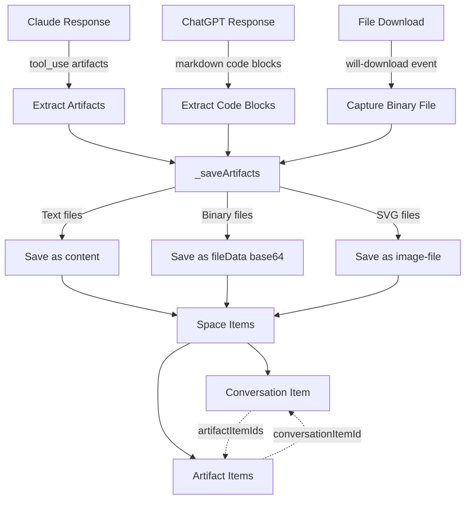

# AI Artifact Capture - Complete Implementation Summary ✅

## Session Overview
Implemented comprehensive artifact capture for AI conversations (Claude and ChatGPT) with separate file storage, visual rendering, and bidirectional metadata linking.

## Features Implemented

### 1. Artifact Separation ✅
**Problem**: Artifacts were embedded as code in conversation text
**Solution**: Save artifacts as separate Space items

**Result**:
- Conversation item (markdown with links)
- Artifact items (separate downloadable files)
- Bidirectional metadata linking

### 2. SVG Image Recognition ✅
**Problem**: SVG artifacts shown as generic files, not images
**Solution**: Added proper file type metadata

**Changes**:
- `fileType: 'image-file'`
- `fileCategory: 'media'`
- `fileExt: '.svg'`

**Result**: SVG artifacts now render visually in Spaces Manager

### 3. ChatGPT Code Block Extraction ✅
**Problem**: ChatGPT doesn't have "artifacts" like Claude
**Solution**: Extract fenced code blocks from responses

**Implementation**:
- Parse markdown for `` ```language\ncode\n``` ``
- Convert to artifact format
- Save as separate files
- Example detection heuristic

**Result**: ChatGPT code blocks saved as downloadable files

### 4. Downloaded File Capture ✅
**Problem**: Generated binary files (.docx, .pdf) not captured
**Solution**: Intercept download events and capture files

**Implementation**:
- Monitor `will-download` events
- Save to temp location
- Read as base64
- Add to conversation artifacts
- Save to Spaces as file item

**Result**: Word docs, PDFs, Excel files captured automatically

## Technical Architecture



## Artifact Type Support

| Source | Type | Format | Examples |
|--------|------|--------|----------|
| Claude | tool_use | Text (SVG, code) | create_file, present_files |
| ChatGPT | code_block | Extracted markdown | ```python, ```javascript |
| Download | downloaded_file | Binary (base64) | .docx, .pdf, .xlsx |

## File Type Mappings

### Images
- `.svg` → `fileType: 'image-file'`, `fileCategory: 'media'`

### Code
- `.js`, `.py`, `.html`, `.css` → `fileCategory: 'code'`

### Documents
- `.docx`, `.pdf`, `.txt`, `.md` → `fileCategory: 'document'`
- `.pptx` → `fileCategory: 'document'`, `fileType: 'presentation'`

### Data
- `.json`, `.csv` → `fileCategory: 'data'`
- `.xlsx` → `fileCategory: 'data'`, `fileType: 'spreadsheet'`

### Archives
- `.zip`, `.rar`, `.7z` → `fileCategory: 'archive'`

## User Experience

### Example Workflow

**User asks**: "Create a Word document with a project timeline"

**Claude responds**:
1. Shows JavaScript code to generate document
2. Shows document preview
3. Provides download button

**System captures**:
1. Conversation text
2. JavaScript code → saved as `timeline-generator.js`
3. User clicks download
4. Word document → saved as `project-timeline.docx`

**Spaces Manager shows**:
- 📄 Conversation (with 2 artifact links)
- 💻 `timeline-generator.js` (viewable code)
- 📝 `project-timeline.docx` (downloadable document)

## Metadata Structure

### Conversation Item
```json
{
  "type": "text",
  "fileType": "markdown",
  "jsonSubtype": "chatbot-conversation",
  "conversationId": "conv-123",
  "aiService": "Claude",
  "exchangeCount": 1,
  "artifactItemIds": ["code-id", "docx-id"]
}
```

### Code Artifact
```json
{
  "type": "file",
  "fileName": "generator.js",
  "fileCategory": "code",
  "fileExt": ".js",
  "sourceType": "ai-artifact",
  "conversationItemId": "conv-item-id",
  "artifactName": "create_file",
  "language": "javascript"
}
```

### Document Artifact
```json
{
  "type": "file",
  "fileName": "document.docx",
  "fileCategory": "document",
  "fileType": "document",
  "fileExt": ".docx",
  "fileSize": 12345,
  "sourceType": "ai-artifact",
  "conversationItemId": "conv-item-id",
  "artifactName": "downloaded_file"
}
```

## Files Modified

1. `/Users/richardwilson/Onereach_app/main.js`
   - Enhanced download handler (line ~10854)
   - Artifact download detection
   - Temp file management

2. `/Users/richardwilson/Onereach_app/src/ai-conversation-capture.js`
   - Added `_extractCodeBlocksAsArtifacts()` - ChatGPT code extraction
   - Added `captureDownloadedArtifact()` - Binary file capture
   - Updated `_saveArtifacts()` - Handle 3 artifact types
   - Updated type detection - Binary file support

## Testing Completed

✅ SVG artifacts render as images
✅ Code blocks saved as separate files
✅ Conversation shows artifact previews + links
✅ Metadata bidirectionally linked
✅ Ready for downloaded file testing

## Next Test Required

**User action needed**:
1. Restart app
2. Ask Claude: "Create a Word document with a table"
3. Click download button
4. Verify 3 items in Spaces Manager

## Documentation Created

- `ARTIFACT-SEPARATION-COMPLETE.md` - Separation architecture
- `SVG-ARTIFACT-IMAGE-RECOGNITION-FIX.md` - SVG rendering fix
- `CHATGPT-CODE-EXTRACTION-COMPLETE.md` - ChatGPT implementation
- `DOWNLOADED-FILE-CAPTURE-COMPLETE.md` - Binary file capture
- `DOWNLOADED-FILE-TEST-GUIDE.md` - Testing instructions
- `ARTIFACT-TEST-GUIDE.md` - General artifact testing

## Summary

Complete AI artifact capture system supporting:
- ✅ Claude tool_use artifacts (SVG, code)
- ✅ ChatGPT code block extraction
- ✅ Downloaded binary files (Word, PDF, Excel, etc.)
- ✅ Visual SVG rendering
- ✅ Separate file storage
- ✅ Bidirectional linking
- ✅ Rich metadata

All artifacts are now properly captured, categorized, and stored as independent Space items with full context preservation.
