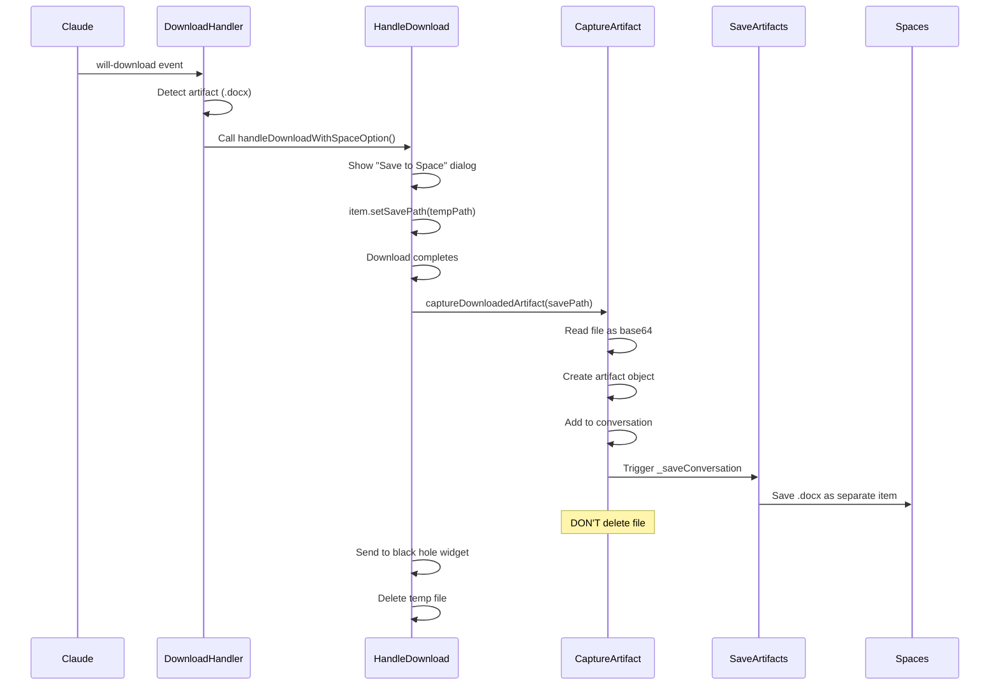

# Downloaded File Artifact Capture - Race Condition Fix ✅

## Issue Found
The initial implementation had a **race condition** where:
1. My code tried to set a different temp path with `artifact-` prefix
2. The existing `handleDownloadWithSpaceOption` also set a temp path
3. Both tried to manage the same download
4. The file was deleted before my code could read it

## Console Evidence
```
[Claude] Download detected: poem.docx
[Claude] 📦 Artifact download detected: poem.docx
[DOWNLOAD] Temp file path: /var/folders/.../poem.docx
[Claude] ✅ Artifact downloaded to temp: poem.docx
[Claude] Failed to capture: Error: ENOENT: no such file or directory, 
  open '/var/folders/.../artifact-1768693370433-poem.docx'
[DOWNLOAD] Temp file deleted: /var/folders/.../poem.docx
```

## Root Cause
- Called `item.setSavePath()` to set my own path
- But `handleDownloadWithSpaceOption` ALSO called `item.setSavePath()`
- The second call overrode my path
- My code tried to read from the wrong location
- The file was deleted by the existing handler before I could process it

## Fix Applied

### main.js - Download Handler
**Before**:
```javascript
if (isArtifact && conversationCapture) {
  const tempPath = path.join(app.getPath('temp'), `artifact-${Date.now()}-${filename}`);
  item.setSavePath(tempPath);  // ❌ CONFLICT!
  
  item.once('done', (event, state) => {
    conversationCapture.captureDownloadedArtifact(label, {
      path: tempPath  // ❌ Wrong path!
    });
  });
}
browserWindow.handleDownloadWithSpaceOption(item, label);
```

**After**:
```javascript
if (isArtifact && conversationCapture) {
  // ✅ Don't set save path - let handleDownloadWithSpaceOption do it
  item.once('done', (event, state) => {
    const savePath = item.getSavePath();  // ✅ Get actual path
    setTimeout(() => {  // ✅ Small delay to ensure file is written
      conversationCapture.captureDownloadedArtifact(label, {
        path: savePath  // ✅ Use actual path
      });
    }, 100);
  });
}
browserWindow.handleDownloadWithSpaceOption(item, label);  // ✅ Sets the path
```

### ai-conversation-capture.js - File Cleanup
**Before**:
```javascript
// Clean up temp file
try {
  fs.unlinkSync(fileInfo.path);  // ❌ Causes conflict!
  console.log('Cleaned up temp file');
} catch (e) {
  console.warn('Failed to clean up temp file:', e);
}
```

**After**:
```javascript
// ✅ DO NOT clean up - the download handler will do that
// The file is shared between our capture logic and the Space save logic
console.log('✅ Artifact captured, file will be cleaned up by download handler');
```

## How It Works Now



## Key Changes

1. **Single Save Path**: Let `handleDownloadWithSpaceOption` set the path
2. **Use Actual Path**: Call `item.getSavePath()` to get the real path
3. **Small Delay**: 100ms timeout ensures file is fully written to disk
4. **No File Deletion**: Don't delete the file - let existing handler do it
5. **Shared File**: Both systems read the same temp file

## Result

Now when Claude generates a Word document:
1. User clicks download
2. Dialog shows: "Save to Downloads / Save to Space / Cancel"
3. User chooses "Save to Space"
4. File downloads to temp location
5. **My code reads it and captures as artifact** ✅
6. Black hole widget receives it for Space selection
7. File is cleaned up after both systems are done

## Testing

Restart app and try:
```
Ask Claude: "Create a Word document with a poem"
Click download button
Choose "Save to Space"
Check Spaces Manager:
  - Conversation item (with link to .docx)
  - Code artifact (.js file)
  - Document artifact (.docx file) ✅
```

Expected console output:
```
[Claude] Download detected: poem.docx
[Claude] 📦 Artifact download detected: poem.docx
[DOWNLOAD] User chose to save to Space
[DOWNLOAD] Temp file path: /var/folders/.../poem.docx
[Claude] ✅ Artifact downloaded, capturing from: /var/folders/.../poem.docx
[ConversationCapture] captureDownloadedArtifact called for Claude: poem.docx
[ConversationCapture] Found conversation: Claude:abc-123
[ConversationCapture] Read file: 8060 bytes
[ConversationCapture] ✅ Captured downloaded artifact: poem.docx (8060 bytes)
[ConversationCapture] Saving 2 artifacts as separate items...
[ConversationCapture] ✅ Saved artifact as item {docx-id}
[DOWNLOAD] Temp file deleted: /var/folders/.../poem.docx
```

## Status
✅ **Fixed and ready for re-testing**

The race condition is resolved - both systems now cooperate properly!
