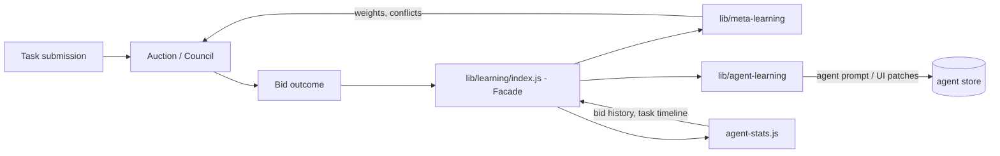

# Learning Subsystems

> Authoritative boundary between the two learning stacks in the repo.
> Introduced in Phase 1.5 of the agent-system upgrade.

## The two stacks

The Onereach app evolved two parallel learning systems. They overlap in
appearance ("both learn from agents") but have orthogonal jobs. Phase
1.5 draws a clean boundary and documents it here so every subsequent
phase (Phase 2 learned weights, Phase 4 per-criterion feedback, Phase 5
elicitation adequacy, Phase 6 flow gateway) knows which one to call.



## meta-learning = "whose vote counts, and by how much"

Location: [lib/meta-learning/](../../lib/meta-learning/)

Jobs:
- **Agent weighting** -- `AgentPerformanceMemory.getRecommendedWeight(agentType, context)`
  returns a 0.5-1.5 multiplier computed from overall accuracy, context-
  specific performance, false-positive rate, and performance trend.
  Consumed by `AgentWeightingManager` in learned/user-biased modes.
- **Conflict resolution learning** -- `ConflictResolutionLearner` tracks
  which agent tends to be right when two agents disagree on a criterion.
  Consumed by `EvaluationConsolidator` during council runs.
- **Governance** -- `MetaLearningGovernance` gates learning updates
  behind minimum sample counts, audit logs every change, and supports
  pending-approval workflow for risky updates.
- **Adaptive strategy** -- chooses which agent pool to invite to an
  evaluation for a given document type.

Keying: agentType (e.g. `calendar-query`, `expert`, `reviewer`). This is
a logical category; many agentIds can share one type. Mapping is done
by `_deriveAgentType()` in [lib/exchange/council-adapter.js](../../lib/exchange/council-adapter.js).

Reads / writes: in-memory storage by default; callers can inject a
persistent `storage` option. The evaluation IPC handlers at
[lib/ipc/evaluation-handlers.js](../../lib/ipc/evaluation-handlers.js)
wire up a singleton instance used by the evaluation-hud UI.

Consumer surfaces:
- `lib/evaluation/weighting.js` -- uses meta-learning in LEARNED mode
- `lib/evaluation/consolidator.js` -- uses ConflictResolutionLearner
- `packages/agents/unified-bidder.js` -- will use it in Phase 2 to
  multiply bid confidence by the learned weight before threshold check

## agent-learning = "what did this agent learn, and what should change"

Location: [lib/agent-learning/](../../lib/agent-learning/)

Jobs:
- **Interaction collection** -- `InteractionCollector` windows successes,
  failures, rephrases, and response times per agent. Feeds improvement
  evaluation.
- **Memory curation** -- `memory-curator` dedupes fuzzy-duplicate
  learning notes and ages out stale entries in per-agent memory files
  under Spaces. Runs every 6 hours.
- **Memory retrieval** -- `memory-retriever` scores agent memory lines
  by relevance * recency * density * pin boost and returns top-K lines
  for direct prompt splicing (used by the bidder).
- **Known-issue checks** -- `known-agent-issues` runs free (no-LLM)
  checks like "no dataSources declared" or "UI spec malformed".
- **Improvement engine** -- when an agent is consistently failing,
  generates a prompt patch via LLM (with budget + governance gates),
  verifies via `quality-verifier`, writes a playbook for the change.
- **UI improver** -- same loop for `ui:` agents that return HTML panels.
- **Cross-agent learning** -- detects patterns that span multiple agents
  and emits cross-cutting improvements.
- **Reflection feedback** -- subscribes to `learning:low-quality-answer`
  and `learning:negative-feedback` and writes dated entries into the
  producing agent's "Learning Notes" section of its memory file.
- **Playbook writer** -- every deployed improvement gets a playbook so
  the change is reproducible and reviewable.

Keying: agentId (e.g. `calendar-query-agent`). Agent-learning works
against concrete agents, not weighting types.

Reads / writes: Spaces (per-agent memory files), the budget manager
(enforces `dailyBudget` at 50 cents by default), the agent store (for
prompt patches).

Consumer surfaces:
- `src/voice-task-sdk/exchange-bridge.js` -- hooks at lines 3539, 3623,
  3675 record interaction outcomes live.
- `packages/agents/unified-bidder.js` -- reads retriever top-K into the
  bid prompt's memory section.
- `packages/agents/omni-data-agent.js` -- reads retriever in
  `getRelevantContext`.

## The one-way dependency rule

- **agent-learning can read from meta-learning.** Example: the
  improvement engine can consult agent accuracy trend before deciding
  to apply a prompt patch.
- **meta-learning MUST NOT read from agent-learning.** Weighting and
  conflict resolution decisions are made from outcome data, not from
  agent memory notes.

Why: circular dependency means a bad prompt patch can silently lower
an agent's weight, which in turn makes its patches matter less, which
in turn makes improvements "stick" without actually being verified.
Breaking the cycle keeps the two loops separately auditable.

## Shared surface: `agent-stats.js`

Both subsystems read `src/voice-task-sdk/agent-stats.js`:
- meta-learning reads `bid-history.json` and task timeline to compute
  weights.
- agent-learning's interaction-collector reads the same files to detect
  failure patterns.
- agent-stats is the **single source of truth for raw outcome data**.
  Both subsystems treat it as read-mostly.

## The facade: `lib/learning/index.js`

To keep call sites simple, Phase 1.5 introduces a thin facade
[lib/learning/index.js](../../lib/learning/index.js) with one entry
point every auction outcome should hit:

```js
const { recordBidOutcome } = require('./lib/learning');
await recordBidOutcome({
  agentId: 'calendar-query-agent',
  taskId: 't_abc',
  confidence: 0.85,        // what the bid said
  won: true,                // did this bid become the assigned agent?
  success: true,            // did execution succeed?
  durationMs: 1234,
  error: null,
});
```

The facade fans out to:
1. **agent-stats** -- `recordWin` / `recordSuccess` / `recordFailure`
2. **meta-learning** -- `outcomeTracker.recordOutcome(...)` if the bid
   context included a council evaluation id
3. **agent-learning** -- `interactionCollector.record({...})` so the
   improvement loop sees the interaction

Call sites (single-winner and council paths) use the facade; they do
NOT call either subsystem directly. This is how we keep the two from
drifting apart again.

## Decision rule: "which subsystem for which question"

| Question | Subsystem |
|---|---|
| Should agent X's vote count more than agent Y's? | meta-learning (weighting) |
| When agent X and Y disagree on criterion C, who is usually right? | meta-learning (conflict learner) |
| Is agent X's prompt broken? | agent-learning (improvement engine) |
| What memory should we inject into agent X's next bid prompt? | agent-learning (memory retriever) |
| Did agent X just give a low-quality answer I should remember? | agent-learning (reflection feedback) |
| What is agent X's overall accuracy trend? | meta-learning (AgentPerformanceMemory) |
| Should we roll back an accuracy update that looks anomalous? | meta-learning (governance) |

## Migration notes

- Legacy callers that directly call `outcomeTracker.recordOutcome(...)`
  outside the evaluation-hud path should migrate to `recordBidOutcome`.
- Legacy callers that directly call `interactionCollector.record(...)`
  from hud-api or exchange-bridge should also migrate. The facade
  preserves their current semantics.
- Phase 2 depends on this doc being correct: it wires the unified-
  bidder's winner-selection to multiply by `meta-learning.getRecommendedWeight`.
  That hook only makes sense if agent-learning isn't fighting it.
