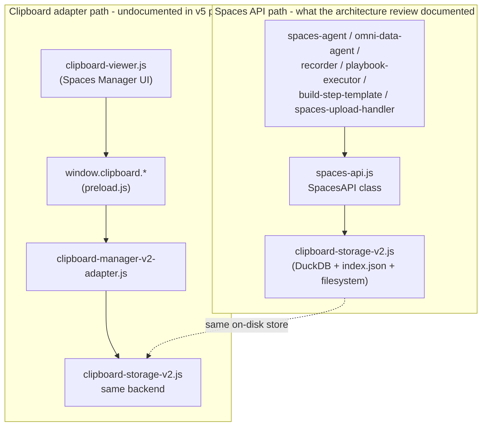
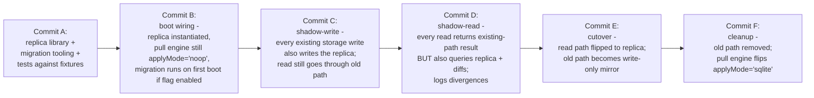

# sync-v5 Materialised Replica — Shape, Equivalence, and Cutover

**Status**: planning. No code yet. This document is the prerequisite for the
materialised-replica implementation work that activates v5 invariants 1, 2,
and 6 (source-of-truth, convergence, read-path).

**Owner**: TBD; the replica is the next architectural step after the
`db2a614 → 0d0187b` v5 commit chain.

**Reading**: pair this with the v5 architectural review at
`/Users/richardwilson/.cursor/plans/spaces_+_neo4j_(neon)_source-of-truth_architecture_review_(v5)_*.plan.md`,
sections 4.1 / 4.6 / 5.

---

## 0. Goal in one sentence

The materialised replica is a per-device SQLite database that exposes the
exact query surface today's Spaces consumers depend on, populated by
deterministic projection of `:Space` and `:Asset` rows from the graph (and,
during cutover, by mirror writes from the existing
`clipboard-storage-v2.js`). When the replica is in place, the existing
storage becomes a write-shim during cutover and is removed entirely after.

Verifiable success criterion: every test that passes today against
`clipboard-storage-v2.js` + `index.json` + `OR-Spaces/` also passes against
the replica, and `pull-engine.applyMode` flips from `noop` to `sqlite` in
boot wiring without any consumer change.

---

## 1. Surprise discovered during recon

The Spaces stack today has **two parallel datastore paths**, not one. Any
replica plan that addresses only `spaces-api.js` is a partial solution.



The two paths share the same physical storage (one DuckDB, one
`index.json`, one `OR-Spaces/items/` tree) but expose different in-process
APIs and **different search backends**:

- `spaces-api.search(query, opts)` — used by `spaces-agent` and other
  agent code; goes through `clipboard-storage-v2.search()` with
  `searchTags`, `searchMetadata`, `searchContent`, `fuzzy`,
  `fuzzyThreshold`, `includeHighlights` options
  ([spaces-api.js:1295-1385](spaces-api.js)).
- `window.clipboard.search(query)` — used by `clipboard-viewer`; routes
  through the adapter and does its own thing
  ([clipboard-manager-v2-adapter.js:1086-1091](clipboard-manager-v2-adapter.js)).

**Consequence for the replica**: it must satisfy both paths, OR the
cutover plan must unify them first. Recommendation: **unify before
replicating**. The clipboard adapter's read methods become thin wrappers
over `spaces-api`, then the replica targets only `spaces-api`'s surface.
This is one extra commit's worth of work (~2-3 days, mostly tests) and
saves an indefinite tail of "the replica works for agents but the UI
shows different results" debugging.

---

## 2. Query surface the replica must answer

Enumerated from production callers. Frequency notes apply at this user's
single-device scale; treat them as relative not absolute.

### 2.1 Hot path (per-render or per-event)

- `spaces.list()` — every UI init, every space-tab switch. Returns
  `{id, name, icon, color, itemCount, path, createdAt, updatedAt}[]`.
  ItemCount is derived (`COUNT(*) FROM items WHERE space_id = ?` in
  replica terms; today it's `index.items.filter(...).length`).

- `items.list(spaceId, options)` — every space-tab switch via
  `getSpaceItems`, also direct from agents and recorder. Options:
  `{limit, offset, type, pinned, tags, anyTags, includeContent}`.
  Sort: pinned first, then `timestamp` desc.
  - **Tag semantics**: `tags` = ALL must match; `anyTags` = ANY must
    match. Case-insensitive in current implementation.
  - **`includeContent: false`** is the high-frequency case (list views).
    Returns metadata + path references; UI lazy-loads bodies.
  - **`includeContent: true`** is the slow-path case (smart export,
    playbook-executor build steps). Reads body from filesystem via
    `loadItem(itemId)`.

- `items.get(spaceId, itemId)` — preview / detail open in UI; agent
  context lookup (`gsx-agent-main-context`, `gsx-agent-profile` are
  fixed item IDs read by `omni-data-agent` and cached). Returns
  full item including parsed `metadata`.

- `search(query, options)` — debounced UI search input;
  `spaces-agent`'s `{ limit: 10 }` voice queries; recorder lookups.
  Options: `{spaceId, type, searchTags, searchMetadata, searchContent,
  fuzzy, fuzzyThreshold, limit, includeHighlights}`. Defaults:
  searchTags=true, searchMetadata=true, searchContent=false,
  fuzzy=true, fuzzyThreshold=0.7, includeHighlights=true.
  Returns items extended with
  `_search: {score, matches, highlights?}`.

### 2.2 Cross-space and aggregate

- `tags.list(spaceId)` → `[{tag, count}]` per space.
- `tags.listAll()` → `[{tag, count, spaces: string[]}]` global.
- `tags.findItems(tags, options)` — options: `{spaceId?, matchAll?,
  limit?}`. matchAll defaults to false (any match).
- Smart folders evaluate cross-space against `criteria: {tags, anyTags,
  types, spaces}`.

### 2.3 Specific-tag filters used by integrations

These are the implicit contracts that need replica equivalence:

- `items.list(spaceId, { tags: ['riff-source'], includeContent: true })`
  — WISER Playbooks build steps ([build-step-template.html:244](build-step-template.html)).
- `items.list(spaceId, { tags: ['wiser-meeting'], includeContent: true })`
  — WISER meeting capture ([recorder.js:621-625](recorder.js)).
- `items.list(spaceId, { tags: ['wiser-template'] })` — WISER templates
  ([recorder.js:674-677](recorder.js)).
- `metadata.source === 'riff' | 'wiser-playbooks'` — playbook detection
  in `playbook-executor._isPlaybook`. Tag-equivalent for cross-asset
  filtering.

### 2.4 Mutation surface

- `items.add(spaceId, item)` — called by clipboard capture (high
  frequency at the user level), agents, and direct UI saves. Payload:
  `{type, content, metadata?, source?, skipAutoMetadata?}`.
- `items.update(spaceId, itemId, data)` — partial item-row update.
- `items.delete(spaceId, itemId)`, `items.deleteMany(spaceId, ids[])`.
- `items.move(itemId, fromSpaceId, toSpaceId)`,
  `items.moveMany(ids[], from, to)`.
- `items.togglePin(spaceId, itemId)` → returns new boolean.
- Tag mutations: `items.getTags / setTags / addTag / removeTag`.
- `spaces.create / update / delete`.

### 2.5 Filesystem-shaped read

- `files.read(spaceId, relativePath)` — UTF-8 markdown read, used by
  `unified-bidder` for `gsx-agent/conversation-history.md` and
  `gsx-agent/session-summaries.md`
  ([spaces-api.js:1994-2002](spaces-api.js)).

The replica doesn't model this directly — it remains a filesystem
operation against `OR-Spaces/spaces/<spaceId>/<relativePath>`. The
replica's content cache (keyed by `contentHash`) is a separate layer.

---

## 3. Replica SQLite schema

Mirrors the DuckDB schema in
[clipboard-storage-v2.js:209-294](clipboard-storage-v2.js) with two
additions for v5: `vc` (vector clock) and `vc_after_hash` (digest of vc
for indexed lookups).

```sql
-- Spaces table: one row per :Space.
CREATE TABLE spaces (
  id TEXT PRIMARY KEY,
  name TEXT NOT NULL,
  icon TEXT,
  color TEXT,
  is_system INTEGER DEFAULT 0,           -- 0/1; SQLite has no BOOLEAN
  created_at TEXT NOT NULL,              -- ISO 8601
  updated_at TEXT NOT NULL,
  vc TEXT NOT NULL DEFAULT '{}',         -- JSON-encoded VectorClock
  active INTEGER NOT NULL DEFAULT 1
);
CREATE INDEX idx_spaces_active ON spaces(active);

-- Items table: one row per :Asset.
CREATE TABLE items (
  id TEXT PRIMARY KEY,
  type TEXT NOT NULL,
  space_id TEXT NOT NULL DEFAULT 'unclassified',
  timestamp INTEGER NOT NULL,            -- ms since epoch
  preview TEXT,
  content_path TEXT,
  thumbnail_path TEXT,
  metadata_path TEXT,
  tags TEXT NOT NULL DEFAULT '[]',       -- JSON-encoded string[]
  pinned INTEGER NOT NULL DEFAULT 0,
  file_name TEXT,
  file_size INTEGER,
  file_type TEXT,
  file_category TEXT,
  file_ext TEXT,
  is_screenshot INTEGER DEFAULT 0,
  json_subtype TEXT,
  -- Source / provenance (mirrors clipboard-storage-v2 GSX columns)
  source TEXT,
  metadata_source TEXT,
  -- v5 additions
  content_hash TEXT,                     -- SHA-256, references blob store
  vc TEXT NOT NULL DEFAULT '{}',         -- JSON-encoded VectorClock
  active INTEGER NOT NULL DEFAULT 1,     -- soft-delete flag (tombstoned items)
  deleted_at TEXT,                       -- ISO 8601 if active=0
  deleted_by TEXT,                       -- deviceId from :Tombstone
  created_at TEXT NOT NULL,
  modified_at TEXT NOT NULL,
  has_parked_precursor INTEGER NOT NULL DEFAULT 0  -- DLQ flag from sync-engine
);

-- Mirror the DuckDB indexes for query parity.
CREATE INDEX idx_items_space ON items(space_id, active);
CREATE INDEX idx_items_type ON items(type);
CREATE INDEX idx_items_timestamp ON items(timestamp DESC);
CREATE INDEX idx_items_pinned ON items(pinned, timestamp DESC);
CREATE INDEX idx_items_content_hash ON items(content_hash);

-- Full-text search index for searchContent path (replaces clipboard-storage-v2's
-- ad-hoc fuzzy matching). FTS5 supports BM25 ranking + tokenization.
CREATE VIRTUAL TABLE items_fts USING fts5(
  id UNINDEXED,
  preview,
  content,                               -- lazy-populated when includeContent path runs
  metadata_text,
  tags_text,
  tokenize = 'porter unicode61'
);

-- Tags index (denormalised for tag-aggregate queries).
-- Avoids JSON-array scans on every tags.list call.
CREATE TABLE item_tags (
  item_id TEXT NOT NULL,
  tag TEXT NOT NULL,
  PRIMARY KEY (item_id, tag),
  FOREIGN KEY (item_id) REFERENCES items(id) ON DELETE CASCADE
);
CREATE INDEX idx_item_tags_tag ON item_tags(tag);

-- Smart folders persisted alongside item state for transactional consistency.
CREATE TABLE smart_folders (
  id TEXT PRIMARY KEY,
  name TEXT NOT NULL,
  icon TEXT,
  color TEXT,
  criteria TEXT NOT NULL,                -- JSON {tags, anyTags, types, spaces}
  created_at TEXT NOT NULL,
  updated_at TEXT NOT NULL
);

-- Schema version for migration tooling (Phase 5 hooks here).
CREATE TABLE replica_meta (
  key TEXT PRIMARY KEY,
  value TEXT NOT NULL
);
INSERT INTO replica_meta(key, value) VALUES ('schemaVersion', '1');
INSERT INTO replica_meta(key, value) VALUES ('lastFullPullAt', '');
INSERT INTO replica_meta(key, value) VALUES ('cursor', '');
```

### 3.1 Schema choice notes

- **SQLite over DuckDB**: SQLite is the standard for OLTP-shaped local
  replicas; DuckDB is OLAP-shaped (columnar). Per the v5 plan §4.1 ("one
  DB per device. Holds materialized projection... Replaces DuckDB and
  index.json"), the replica explicitly displaces DuckDB. We can use
  `better-sqlite3` (synchronous, no native build complications on macOS)
  or stick with `@duckdb/node-api` if avoiding the new dep is more
  important than the architectural fit. **Recommendation**: add
  `better-sqlite3` as a dep — it's the right tool, the Electron-build
  story is well-trodden, and SQLite has FTS5 which is a real win for
  the search backend.

- **`tags` denormalised**: `tags.list / listAll / findItems` are common
  enough that scanning JSON arrays in the items table is a wrong
  choice. The `item_tags` join table is the cheap fix.

- **FTS5 for searchContent**: today's
  `clipboard-storage-v2.search` is ad-hoc fuzzy matching across
  preview / metadata. FTS5 with porter+unicode61 tokenization is
  strictly better and gives BM25 ranking for free, replacing the manual
  `_search.score` computation.

- **Soft-delete via `active=0`** + `deleted_at` / `deleted_by` matches
  the v5 tombstone model. The replica retains tombstoned rows
  (compactor doesn't touch them); `:Tombstone` in the graph is the
  authoritative record.

---

## 4. Initial population (cold device)

A device that's never seen the replica before needs to populate it from
either (a) the existing `clipboard-storage-v2` data or (b) the graph.

```mermaid
flowchart TB
  start[First boot with replica enabled] --> check{Local DuckDB +<br/>index.json present?}
  check -->|yes| migrate[Migrate from existing storage:<br/>read index.items / index.spaces<br/>+ each item's metadata.json,<br/>insert into SQLite]
  check -->|no| pull{Graph reachable?}
  pull -->|yes| graphpull[Pull from graph:<br/>MATCH (s:Space)-[:CONTAINS]->(a:Asset)<br/>RETURN s.id, a.id, a.vc, a.contentHash, ...<br/>insert rows;<br/>set lastFullPullAt cursor]
  pull -->|no| empty[Start empty:<br/>replica populated as user adds items<br/>OR as graph becomes reachable]
  migrate --> bothmode[Replica live + clipboard-storage-v2 still mirroring]
  graphpull --> bothmode
  empty --> bothmode
  bothmode --> cutover[After validation window:<br/>flip read path to replica only]
```

The migration-from-existing-storage path is the load-bearing one for
this user (they have ~1019 items). It must:

1. Walk `index.items[]` and `index.spaces[]`.
2. For each item, read `metadata.json` from disk to recover the rich
   metadata that the index doesn't store.
3. Compute SHA-256 of each item's body file, write to the
   content-addressed blob store, set `content_hash` on the SQLite row.
4. Initialise `vc = { [deviceId]: 1 }` for every row (every existing
   item is "this device's first version" from the v5 perspective).
5. Set `replica_meta.lastFullPullAt` so subsequent pulls only fetch
   ops since.

This is one-shot, a few seconds for 1019 items. Should run on first
boot after the replica feature flag flips to true.

---

## 5. Cutover plan

The replica work is **not** a single commit. It's a sequence of
commits with a feature flag gating the read path. The pattern: keep
both code paths live, validate equivalence on production traffic, then
remove the old path.

### 5.1 Phases



### 5.2 Settings flags

```
syncV5.replica.enabled               // default false; flip true to enable
syncV5.replica.shadowReadEnabled    // default false; commit D enables
syncV5.replica.cutoverEnabled       // default false; commit E enables
syncV5.replica.fallbackToOldPath    // default true until commit F
```

The flags ladder: `enabled` true → `shadowReadEnabled` true → run for
some duration → `cutoverEnabled` true → run for some duration →
`fallbackToOldPath` false → commit F.

### 5.3 Rollback

If commit C ships and a divergence is detected in production, the
shadow-read logs (commit D) make the divergence specific. Rollback is
flipping `replica.enabled` to false; the existing path is unaffected
because shadow-write was append-only on the replica, not destructive.

The earliest commit at which "remove old path" is safe is **D + 14
days of clean shadow-read logs**. This is non-negotiable for a personal
data store.

### 5.4 Test surface required

For each public API method the replica must answer, a paired test:

- **Equivalence test**: same args, both paths return byte-identical
  results (or, where ordering is non-deterministic, set-equivalent).
- **Round-trip test**: write through replica, read through old path,
  verify equivalence; and vice versa.
- **Failure-mode test**: replica down → fall back to old path; old path
  down → replica answers from cache.

About 80-120 tests across `items.list / get / add / update / delete /
move / togglePin`, `tags.list / listAll / findItems / addTag /
removeTag`, `search`, `smartFolders.*`, `spaces.*`. The existing test
suite at `test/unit/sync-v5/` reaches ~344 today; the replica equivalence
suite roughly doubles that.

---

## 6. Decisions (locked)

Recorded 2026-04-27, signed off by reviewer. Implementation work
proceeds against these answers.

### 6.1 Library choice — `better-sqlite3` ✓

**Decision**: `better-sqlite3`. The replica explicitly displaces
DuckDB per v5 §4.1 ("Replaces DuckDB and index.json"); SQLite is the
right-tool-for-the-job (real SQL OLTP, FTS5, synchronous API).
Electron-build story is mature.

**Action for commit A**: add to `dependencies` in `package.json`,
verify the postinstall rebuild story for both `arm64` and `x64`
electron builds (existing `package.json` scripts already cover this
for other native deps).

### 6.2 Two-path unification — before cutover ✓

**Decision**: unify `clipboard-viewer.js`'s `window.clipboard.search()`
with `spaces-api.search()` in a dedicated commit before commit A
starts. The replica targets only `spaces-api`'s surface. The
unification is its own ~2-3 day effort, mostly tests.

**Action for pre-A commit**: see §A (Two-path unification
implementation plan) below.

### 6.3 No-shadow filesystem paths ✓

**Decision**: the replica does not model arbitrary
`OR-Spaces/spaces/<spaceId>/<path>` files. The implicit contract is:
**replica owns the catalog (items + tags + smart folders); filesystem
owns raw markdown / files**. Specific no-shadow patterns:

- `gsx-agent/conversation-history.md`
- `gsx-agent/session-summaries.md`
- Any other `gsx-agent/*.md` files (`unified-bidder` and
  `omni-data-agent` read here)

**Action for commit A**: introduce
`syncV5.replica.noShadowPaths: string[]` setting (default
`['gsx-agent/*.md']`). Replica's read path checks the pattern before
querying SQLite; matches fall through to filesystem.

### 6.4 Search backend — FTS5 + document the score shift ✓

**Decision**: ship FTS5. The current ad-hoc fuzzy match is replaced by
FTS5's BM25 scoring, which is ranking-better but changes the
numerical scores. UI-visible: an item that ranked #3 today may rank
#1 tomorrow.

**Action for cutover release notes**: explicit "search ranking
changes; we believe the new ranking is strictly better but if a
specific query result feels worse, file an issue with before/after
screenshots." Shadow-read window (commit D) logs divergent ranking
explicitly so any user-affecting cases surface before cutover.

### 6.5 Tombstone retention — default permanent + opt-in purge ✓

**Decision**: replica `active=0` rows are permanent by default
(mirrors graph `:Tombstone` semantics in v5 §4.3). For
storage-conscious tenants, opt-in purge via
`syncV5.replica.tombstoneRetentionDays` setting (default unset = keep
forever; if set, the periodic compactor purges `active=0` rows older
than the retention plus their content-cache blobs if no live `:Asset`
references the same hash).

**Action for commit A**: add the setting to `settings-manager.js`
defaults; wire into the existing daily compactor scheduler from
`f8a6c58` (the schedule's already in place; just add a per-row
purge step).

### 6.6 Cutover validation gate — N invocations + 7-day floor ✓

**Decision**: cutover (commit E) requires both:

- **Invocation thresholds met**: ≥100 `items.list` calls, ≥100
  `items.get` calls, ≥50 `search` calls, ≥20 tag mutations
  (`addTag` / `removeTag` / `setTags`), ≥10 `smartFolders.getItems`
  calls — counted from when shadow-read started (commit D), with
  zero divergence logs in the same window.
- **AND ≥7 days elapsed** since shadow-read started. The wall-clock
  floor prevents a single-burst day (e.g. user does a one-time data
  cleanup) from satisfying the count threshold without sustained
  multi-day traffic to validate against.

**Action for commit D**: instrument the shadow-read counters per
method; add a `/sync/replica/validation` diagnostics endpoint that
reports current counts vs thresholds + divergence summary. Cutover
flag refuses to flip if either gate is unmet.

---

## 6A. Two-path unification implementation plan

(Added as the §6.2 decision lands. This is the contract for the
pre-A unification commit.)

### 6A.1 What "unify" means concretely

The clipboard-viewer.js UI calls `window.clipboard.search(query)`
which routes through `clipboard-manager-v2-adapter.js`'s search
method, which produces results in a different shape than
`spaces-api.search(query, options)`. Unification means:

**Make `window.clipboard.search(query)` call `spaces-api.search()`
under the hood**, returning results in the same shape, with the same
ranking algorithm (FTS5-bound after the replica lands; today's fuzzy
matcher in the interim). The clipboard-viewer.js renderer adapts to
the new result shape.

After unification: one search backend, one result shape, one set of
behaviours. The replica work then targets only `spaces-api.search`.

### 6A.2 Specific code changes (with line citations)

The actual divergence between the two search backends, found by
reading both implementations:

**Path A — `clipboard-storage-v2.search(query)`** at
[clipboard-storage-v2.js:3119-3220](clipboard-storage-v2.js):
- Synchronous, single-arg `(query: string)`.
- Stop-words filter (`a, an, the, is, ...`) + boolean-AND across
  preview / fileName / metadata fields.
- No scoring, no fuzzy matching.
- Reads `metadata.json` from disk inline per item (slow but
  comprehensive against rich metadata).
- Returns plain item array.

**Path B — `SpacesAPI.search(query, options)`** at
[spaces-api.js:1312-1386](spaces-api.js):
- Async, takes options: `{spaceId, type, searchTags, searchMetadata,
  searchContent, fuzzy, fuzzyThreshold, limit, includeHighlights}`.
- Scoring via `_scoreItem` with fuzzy matching.
- Reads from `storage.getAllItems()` (in-memory index, no disk reads).
- Returns items extended with
  `_search: { score, matches, highlights? }`.
- Sorts by score, then timestamp.
- Honors `limit`.

These are genuinely different implementations. Unification means
**option 1** (per §6.2 decision): make Path A call Path B under the
hood. Path A's caller (`clipboard-viewer.js` UI) stays working
because it consumes the same item fields (preview, fileName,
metadata, etc.), it just additionally gets `_search` it can ignore.

**Specific code changes**:

1. [clipboard-manager-v2-adapter.js:1079-1092](clipboard-manager-v2-adapter.js)
   `searchHistory(query)`: replace `this.storage.search(query)` with
   `await getSpacesAPI().search(query, options)`. Make method async.
   Pass `options` through if any caller passes them (none today).
   Strip `content` field from results to match the
   `_needsContent: true` contract. ~20 lines change.

2. `window.clipboard.search` IPC bridge in
   [preload.js](preload.js): no signature change today (still takes
   `query`); options can be passed through if needed later.
   `searchHistory` is already returned; no change needed unless we
   want to expose options.

3. [clipboard-viewer.js](clipboard-viewer.js) search-result
   rendering: today consumes `item.preview, item.fileName, item.tags,
   item.metadata`. Path B returns the same fields plus `_search`.
   No change required for the basic case; an enhancement to show
   `_search.score` or highlight-ranges in the UI is a separate
   improvement.

4. **Optional but recommended**: remove
   `ClipboardStorageV2.search()` entirely after the migration is
   verified. Today's only caller becomes a thin wrapper through
   `SpacesAPI.search`; the underlying implementation can move into
   `SpacesAPI._scoreItem`. ~80 lines deletion.

### 6A.3 Test surface

The two algorithms produce different results for the same query
(boolean-AND vs. scored fuzzy) so equivalence isn't strict equality.
The right invariant is **non-regression**:

- Every item that `clipboard-storage-v2.search(q)` returns for a
  query `q` must also appear in `SpacesAPI.search(q, {})`'s results
  for the same query (Path B may return more, due to fuzzy matching).
- Result ordering may differ — Path B sorts by score, Path A by
  whatever order `index.items` happened to be in.
- Scoring metadata (`_search`) is additive and shouldn't break Path A
  consumers.

Concrete tests to write (~150-250 lines):

- `test/unit/spaces-search-unification.test.js`:
  - Empty query → both return `[]`.
  - Exact-phrase preview match → Path A's hit appears in Path B.
  - Multi-word query with stop-words → Path A's hit appears in Path B.
  - Tag match → Path A's hit appears in Path B.
  - Fuzzy match (typo) → Path B may match where Path A doesn't (and
    that's acceptable; the goal is "Path A's hits ⊆ Path B's hits",
    not equality).
- `test/unit/clipboard-manager-search-routes-through-spaces-api.test.js`:
  - Mock `getSpacesAPI()`, call `searchHistory()`, assert it
    delegates.
- `test/e2e/spaces-flow.spec.js` (existing): no regression.

### 6A.4 Done criteria + scope

- 100% of `search` calls go through `SpacesAPI.search`.
- `ClipboardStorageV2.search` is either a thin wrapper or removed.
- `clipboard-viewer.js` renderer search input still works
  (manual smoke + e2e).
- Test suite: ~10 new equivalence cases passing.

**Scope estimate**: ~2-3 days focused. The code change is ~50 lines;
the tests + manual smoke is most of the time.

### 6A.3 Done criteria

- 100% of search calls in the codebase go through
  `spaces-api.search`.
- `clipboard-manager-v2-adapter.search` either calls
  `spaces-api.search` or is removed.
- Test suite passes including 5-10 new equivalence cases.
- Manual smoke: type a query in clipboard-viewer.js, observe results
  match what spaces-agent would return for the same query.

### 6A.4 Scope

- Code change: ~50-100 lines (adapter + renderer adapt).
- Tests: ~150-250 lines (equivalence cases + renderer regression).
- Total: ~2-3 days of focused work, mostly tests.

This is its own commit. After it lands, commit A starts with a clean
single-API target.

---

## 6B. Open questions still deferred

(These weren't part of the locked §6 decisions; they're newer or
were never in scope for the planning round.)

### 6B.1 Cold-replica fallback to graph reads

§4 specifies cold-device migration from existing `clipboard-storage-v2`
data when present, otherwise pull-from-graph. Edge case: replica is
present but EMPTY (e.g. user wiped it manually for debugging) and
graph is reachable. Should the replica auto-repopulate from graph, or
require an explicit operator command (`__syncV5.replica.repopulate()`)?

**Tentative**: explicit operator command. Auto-repopulate hides the
"why is this thing empty?" question, which is the kind of state we
want operators to notice.

### 6B.2 Single-device vs multi-tenant deployment

The schema uses `space_id TEXT` not `(tenant_id, space_id)`. This is
correct for the user's single-tenant single-device deployment, but
sync-v5 is theoretically tenant-aware (the v5 plan §5 imagines fleet-
scale operator queries). If multi-tenant is on the roadmap, the
replica needs `tenant_id` everywhere.

**Tentative**: ship single-tenant; add `tenant_id` as a Phase 5
schema migration when the second tenant arrives. The migration tooling
that Phase 5 ships is exactly what this decision exercises.

---

## 7. Scope and timeline

Honest estimate, single-developer, parallel-with-other-work:

- **Decisions** (§6): half-day to lock in.
- **Two-path unification** (§6.2): 2-3 days, mostly tests.
- **Commit A** (replica library + migration + fixture tests): 3-5 days.
- **Commit B** (boot wiring): half-day.
- **Commit C** (shadow-write): 1-2 days, mostly equivalence tests.
- **Commit D** (shadow-read + divergence logging): 1-2 days.
- **Validation window**: gated on §6.6 criteria (likely 1-2 weeks
  elapsed at this user's traffic).
- **Commit E** (cutover): half-day.
- **Commit F** (cleanup, applyMode flip): half-day.

**Total**: ~8-13 days of focused dev work plus the validation window.
This is roughly 2× a v5 phase commit.

The replica is the load-bearing remaining piece. After it lands:
- v5 invariants 1, 2, 6 hold.
- `spaces-sync-manager.js` retires.
- Pull engine `applyMode` flips to `sqlite`.
- Phase 5 migration tooling becomes meaningful (because the first real
  schema bump — SQLite tables — has shipped).
- Phase 0 auth becomes the next architectural priority (Path B device
  rebind for disk-failure recovery).

---

## 8. Verifiable outputs of this document

The document is "complete" when:

- [x] Two-path discovery surfaced and resolved (recommendation: unify
  before cutover, §6.2).
- [x] Query surface enumerated against production callers (§2).
- [x] SQLite schema specified to mirror DuckDB + JSON-index merge,
  with v5-specific additions (§3).
- [x] Cold-device migration path specified (§4).
- [x] Cutover phasing with feature flags + rollback story (§5).
- [x] Open questions named with recommendations (§6).
- [x] Test surface bounded (§5.4).
- [x] Scope estimate (§7).

The document is **not** the implementation. It's the contract the
implementation has to satisfy and the decision boundary for what's
in vs. out. The next step is the §6 decisions, then commit A.
